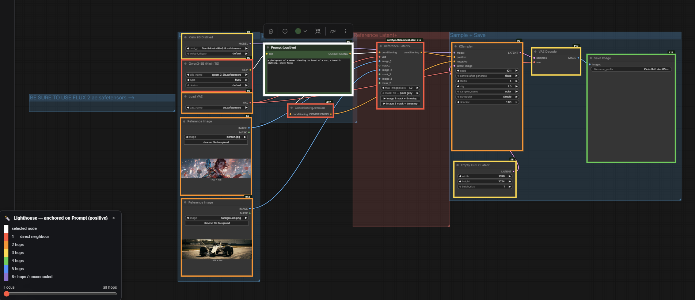
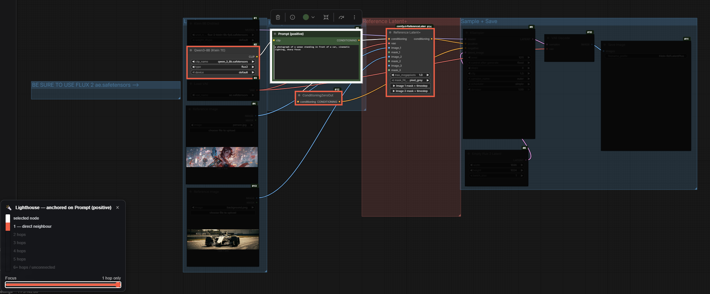
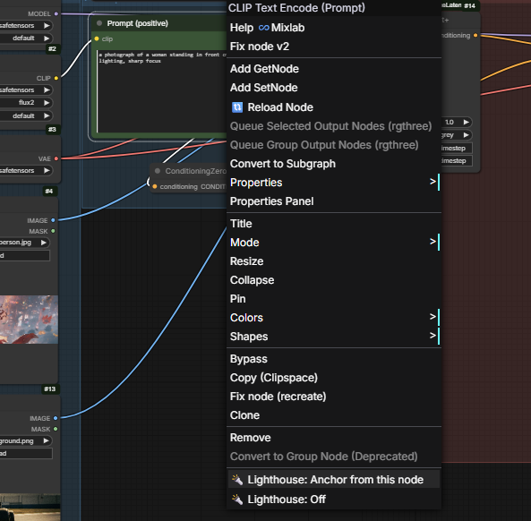

<h1 align="center">Lighthouse — for ComfyUI</h1>

  A non-destructive overlay that lights up every node by graph distance from the one you click. 
  <strong>Diagnostic</strong> for big real workflows · <strong>Educational</strong> for understanding workflows other people built · <strong>Surgical</strong> when you need to focus on one neighbourhood at a time. 
  Direct neighbours glow <strong>red</strong>, then <strong>orange</strong>, <strong>yellow</strong>, <strong>green</strong>, <strong>blue</strong>, <strong>violet</strong> (6+ hops or unconnected).

  

  

---

### Two reasons to use this

**1. Diagnostic — for big, real workflows.**
When a graph grows past ~20 nodes you spend a lot of time mentally tracing wires. "If I tweak this CLIP encode, what does it ripple into? Which sampler is on the other end of this controlnet apply? Why is *that* model loader still wired in — does anything still consume it?" Lighthouse answers all three at a glance. Right-click the node you're curious about, pick **Anchor from this node**, and the whole canvas tells you how the graph relates to it: direct dependencies and consumers in red, two-hops in orange, all the way down. Pull the **Focus** slider up and only the immediate neighbours stay lit while everything further away fades to black — useful for surgically zooming in when a workflow is dense.

**2. Educational — for learning a workflow you didn't build.**
Workflows downloaded from civitai / GitHub / a friend can be intimidating walls of nodes. Lighthouse turns them into a guided tour. Anchor on the **CheckpointLoader** to see the model's full influence radius (everything red is patching the model directly, orange is one step removed, etc.). Anchor on the **KSampler** to see what's feeding the sample. Anchor on a **SaveImage** to walk the chain backward all the way to the inputs. Each anchor point teaches you a different slice of the workflow's structure without having to manually follow every wire.

The slider also makes a great *quiz tool*: dial Focus to max, anchor on a node, and you can only see its 1-hop neighbours — try to predict what's beyond before you slide back down.

  

<em>Same workflow, Focus slider pulled up — only the 1-hop neighbours of the anchor stay lit.</em>

---

### What it does

Right-click any node and pick **🔦 Lighthouse: Anchor from this node**. The rest of the workflow lights up by graph distance from that node:

| Distance | Halo |
|---|---|
| 0 (the clicked node) | bright white double-ring |
| 1 hop (direct neighbours) | red |
| 2 hops | orange |
| 3 hops | yellow |
| 4 hops | green |
| 5 hops | blue |
| 6+ hops or unconnected to anchor | violet |

A floating legend panel appears in the bottom-left of the viewport while the mode is active, with a colourbar and a header that reads "anchored on `<node title>`". Click the **×** in its corner (or the right-click menu's **Off** item) to dismiss — the workflow returns to its normal appearance.

Works in both directions — Lighthouse walks both **upstream** (input links, what feeds this node) and **downstream** (output links, what consumes it).

---

### Right-click menu actions

Two menu items, both on the **node** right-click menu (not the canvas menu):

- **🔦 Lighthouse: Anchor from this node** — runs the BFS straight away from the right-clicked node. Turns Lighthouse on if it was off.
- **🔦 Lighthouse: Off** — turns the mode off and hides the legend panel.

  

---

### How it works

Pure JS extension. When you pick **Anchor from this node**, Lighthouse runs a breadth-first search across `node.inputs[i].link` and `node.outputs[i].links[]` to build a `nodeId → distance` map. The overlay is then drawn by extending `LGraphCanvas.prototype.drawNode` to stroke a coloured ring around each node based on its distance, and to wash a black overlay over its body proportional to the Focus slider position.

**Nothing in the workflow is modified.** No `bgcolor`, no `color`, no link state, no node properties. The overlay is purely visual; turn the mode off and the canvas is identical to before.

---

### Quick start

1. Drop the `comfyui-lighthouse` folder into `ComfyUI/custom_nodes/`.
2. Restart ComfyUI (or reload the browser tab if hot-reloading is on).
3. Right-click any node → **🔦 Lighthouse: Anchor from this node**.
4. The workflow lights up. Drag the **Focus** slider in the legend panel to dial in. Right-click any node → **🔦 Lighthouse: Off** when done.

---

### Limitations / notes

- **Nodes not connected to the anchor are treated as the last band (violet, "6+ hops / unconnected").** They get a violet outline and respond to the Focus slider the same way the actual 6+ hop nodes do, so unconnected nodes are visually distinct from "definitely related but far away".
- **Bidirectional, not directional.** Distance counts hops in either direction. If you only want "downstream from here", that's a future toggle — open an issue if you want it.
- **Multi-select picks the first.** If you have several nodes selected, Lighthouse anchors on the first one. Click a single node to be unambiguous.

---

### Support

If this saves you wire-tracing time:

